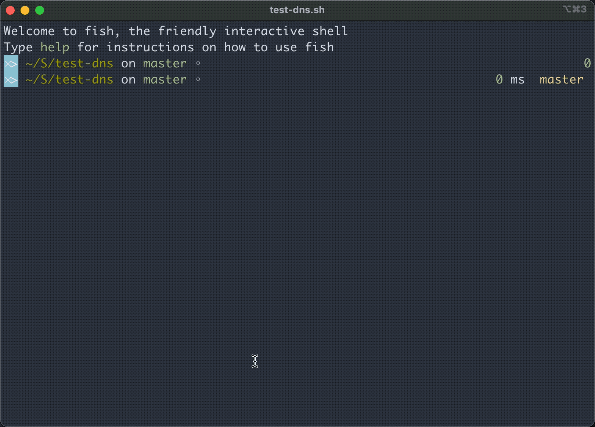

## DNS query speed testing

* `test.sh` - is script which reading `my-dns.txt` file and test DNS with `dig` command



### Usage:

You can use this script with several parameters:
```bash
./test.sh default.txt
```

Also you can optionally set numbers of iterating tests (default is 3):
```bash
/test.sh path/to/ip_list.txt 4
```

Or just for default actions:
```bash
/test.sh
```

### Additional options

* `-r` - Set custom resolver DNS IP
* `-d` - Target resolve domain name
* `-a` - Add IP to $_DEFAULT_LIST
* `-s` - Sort IP list with -l parameter

#### Examples

Customs:
```
./test.sh default.txt 2 -d google.com -r 8.8.8.8
```

Add IP
```
./test.sh -a "173.245.58.52"
```

Add IP and sort:
```
./test.sh -a "173.245.58.52" -s
```

Sort custom list:
```
./test.sh -s -l default.txt
```

```

```

Defaults:
* Resolver - `1.1.1.1`
* Domain target - `lab.sys-adm.in`
* IP list - `default.txt`

### Additional tools

You can use `dnseval`:

```bash
dnseval -f my-dns.txt -c 10 1.1.1.1
```

Or `dnsping`:
```bash
dnsping.py -c 5 --dnssec --flags --tls -t AAAA -s 1.1.1.1 ripe.net
```

Or `dnstrace`:
```bash
docker run redsift/dnstrace -n 50 -c 10 --server 1.1.1.1 --recurse ripe.net
```